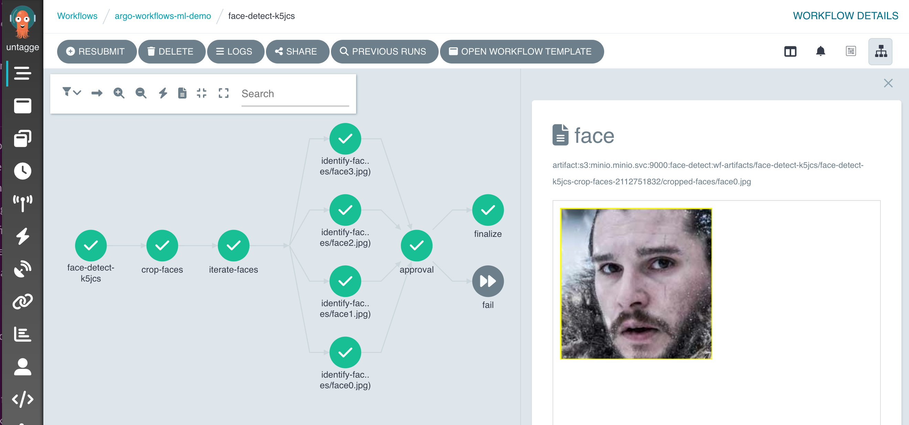
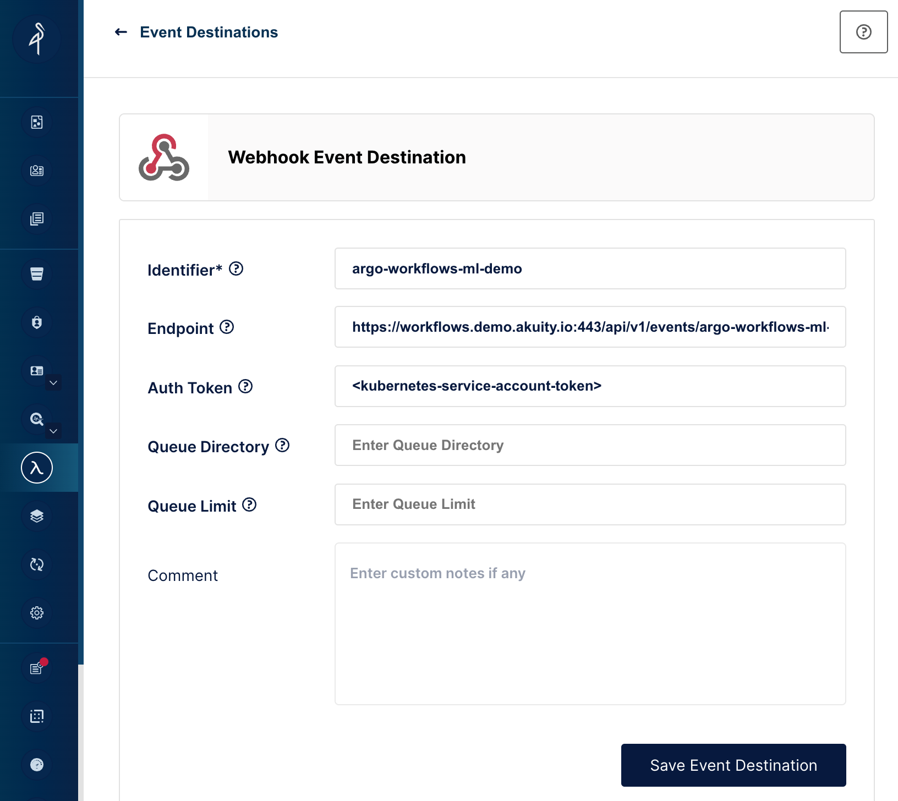
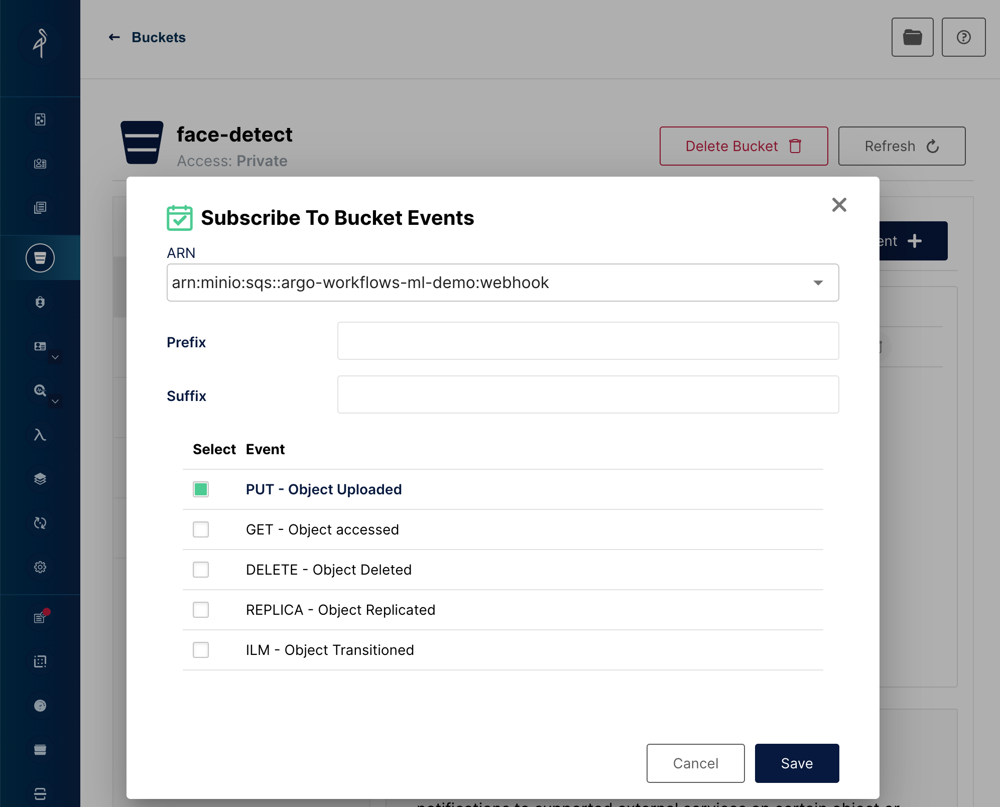
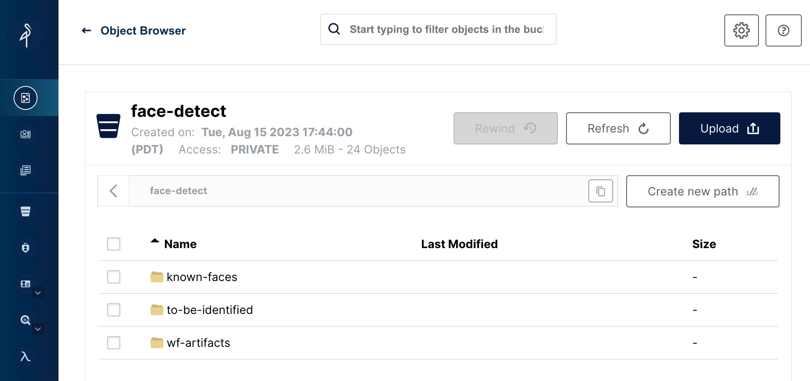

# Argo Workflows Machine Learning Demo

This is an example machine learning workflow which will:
1. Receive a notification from a minio webhook event about an uploaded image to kick off the workflow
2. Download the image, and crop all detected faces into multiple, individual files
3. For each cropped face, parallelly run a face recognition model to identify the name of the face based on a directory of known faces
4. Suspend the workflow and wait for external approval from UI
5. Succeed or fail the workflow depending on approval from previous step

## Requirements
* Argo Workflows v3.5
* S3 bucket (see [minio](minio) directory for example in-cluster minio deployment)

## Workflow features showcased:
* WorkflowEventBinding for submitting a workflow from a minio webhook
* DAG template for defining dependant steps
* Script template for inlined python code
* Input artifacts and artifact passing
* Data template for processing artifacts and generating fan-out steps
* Suspend template with approval
* Conditionals

## Details

### Workflow
* The actual [Workflow](face-detect/wf-face-detect.yaml)

### Webhook

A [WorkflowEventBinding](face-detect/minio-eventbinding.yaml) allows the Argo API server acts as the webhook receiver. 

Minio is configured with a Webhook Event Destination to the Argo API server. e.g.:

* Event ID: argo-workflows-ml-demo
* Event destination: https://workflows.demo.akuity.io:443/api/v1/events/argo-workflows-ml-demo/
* Auth Token: `<bearer token from minio.service-account-token>`

The `face-detect` bucket configures the webhook to subscribe to `PUT` events on the bucket:

### S3 Bucket

The `face-detect` bucket will contain three top-level directories:
* `to-be-identified` - Any upload to this directory will kick off a face-detect workflow
* `known-faces` - Pre-populated directory of images of known people. The name of the jpeg reflect name of the known person (e.g. `Obama.jpg`). For your convenience, you may use the [known-faces](known-faces) directory.
* `wf-artifacts` - Intermediate storage used by the workflows. This can be periodically cleaned.

